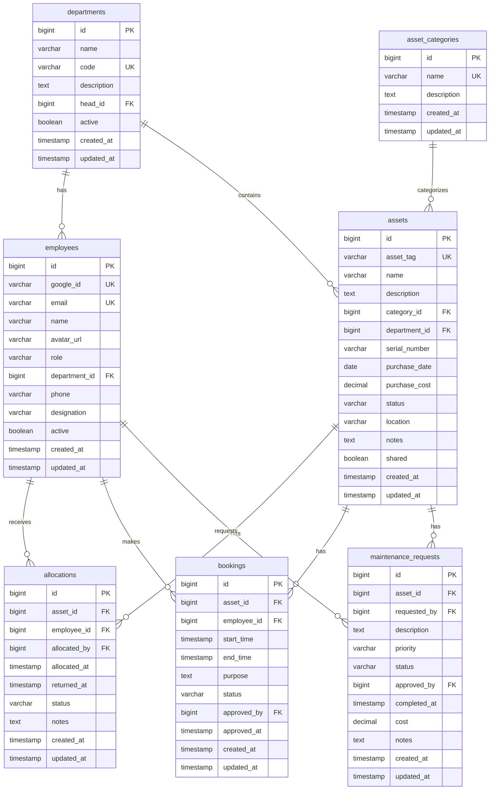

# AssetFlow Backend — Implementation Plan

> [!IMPORTANT]
> **Hackathon Context**: 8-hour hackathon. Backend must be production-quality but pragmatic. Each module will be built, verified, and pushed to GitHub before proceeding.

## Overview

Build a complete Spring Boot 3 backend for an Enterprise Asset Management System with:
- **13 modules** built sequentially
- **Google OAuth2 + JWT** authentication
- **Role-based authorization** (ADMIN, ASSET_MANAGER, DEPARTMENT_HEAD, EMPLOYEE)
- **PostgreSQL** database with JPA entities
- **Business rule enforcement** (no double allocation, no overlapping bookings, etc.)

---

## Tech Stack

| Layer | Technology |
|-------|-----------|
| Language | Java 21 |
| Framework | Spring Boot 3.3.x |
| Security | Spring Security + OAuth2 Client + JWT (jjwt) |
| Database | PostgreSQL + Spring Data JPA |
| Build | Maven |
| Utilities | Lombok, MapStruct, Validation (Jakarta) |
| API Docs | SpringDoc OpenAPI (Swagger) |

---

## Module Execution Order

Each module follows a strict build order. After each module, you push to GitHub before we proceed.

### Module 1 — Project Setup
**Files Created:**
- `pom.xml` — All dependencies (Spring Boot 3, Security, OAuth2, JPA, PostgreSQL, JWT, Lombok, MapStruct, Validation, SpringDoc)
- `src/main/resources/application.yml` — DB config, OAuth2 config, JWT config, CORS
- `src/main/java/com/assetflow/AssetFlowApplication.java` — Main class
- `src/main/resources/application-dev.yml` — Dev profile overrides
- `.gitignore`
- `README.md`

**Package structure created (empty packages with package-info.java):**
```
com.assetflow.auth
com.assetflow.config
com.assetflow.security
com.assetflow.common
com.assetflow.employee
com.assetflow.department
com.assetflow.assetcategory
com.assetflow.asset
com.assetflow.allocation
com.assetflow.booking
com.assetflow.maintenance
com.assetflow.dashboard
```

---

### Module 2 — Security & Authentication
**Files Created:**

#### Security Config
- `security/JwtService.java` — Generate/validate JWT tokens, extract claims
- `security/JwtAuthenticationFilter.java` — OncePerRequestFilter, extract JWT from header
- `security/SecurityConfig.java` — SecurityFilterChain, CORS, CSRF, OAuth2, JWT filter
- `security/CustomOAuth2UserService.java` — Load/create user from Google profile
- `security/OAuth2AuthenticationSuccessHandler.java` — Generate JWT on successful OAuth2 login
- `security/CustomAuthenticationEntryPoint.java` — 401 JSON response
- `security/CurrentUser.java` — Custom annotation for injecting current user
- `security/CurrentUserArgumentResolver.java` — Resolve @CurrentUser annotation

#### Auth Controller
- `auth/AuthController.java` — `/api/auth/me`, `/api/auth/logout`
- `auth/dto/AuthResponse.java` — JWT token response DTO
- `auth/dto/UserInfo.java` — Current user info DTO

#### Config
- `config/WebMvcConfig.java` — CORS configuration, argument resolvers
- `config/AppProperties.java` — Custom app properties (JWT secret, expiry, etc.)

> [!NOTE]
> The Employee entity will be created as a minimal version in this module since OAuth2 login needs it. It will be fully fleshed out in Module 4.

---

### Module 3 — Common Module
**Files Created:**
- `common/dto/ApiResponse.java` — Standard response wrapper (success, message, data, timestamp)
- `common/dto/PagedResponse.java` — Paginated response wrapper
- `common/exception/ResourceNotFoundException.java`
- `common/exception/BadRequestException.java`
- `common/exception/AccessDeniedException.java`
- `common/exception/ConflictException.java`
- `common/exception/GlobalExceptionHandler.java` — @RestControllerAdvice
- `common/enums/Role.java` — ADMIN, ASSET_MANAGER, DEPARTMENT_HEAD, EMPLOYEE
- `common/enums/AssetStatus.java` — AVAILABLE, ALLOCATED, UNDER_MAINTENANCE, DISPOSED
- `common/enums/AllocationStatus.java` — ACTIVE, RETURNED, TRANSFERRED
- `common/enums/BookingStatus.java` — PENDING, APPROVED, REJECTED, CANCELLED, COMPLETED
- `common/enums/MaintenanceStatus.java` — PENDING, APPROVED, IN_PROGRESS, COMPLETED, REJECTED
- `common/entity/BaseEntity.java` — Common fields (id, createdAt, updatedAt)
- `common/util/Constants.java` — Application constants

---

### Module 4 — Employee Module
**Files Created:**
- `employee/entity/Employee.java` — Full entity (id, googleId, email, name, avatarUrl, role, department, phone, designation, active)
- `employee/dto/EmployeeResponse.java`
- `employee/dto/UpdateEmployeeRequest.java`
- `employee/dto/PromoteRoleRequest.java`
- `employee/mapper/EmployeeMapper.java` — MapStruct mapper
- `employee/repository/EmployeeRepository.java`
- `employee/service/EmployeeService.java`
- `employee/controller/EmployeeController.java`

**Endpoints:**
| Method | Path | Access |
|--------|------|--------|
| GET | `/api/employees` | ADMIN |
| GET | `/api/employees/{id}` | ADMIN, self |
| PUT | `/api/employees/{id}` | ADMIN, self |
| PATCH | `/api/employees/{id}/role` | ADMIN only |
| GET | `/api/employees/me` | Any authenticated |

---

### Module 5 — Department Module
**Files Created:**
- `department/entity/Department.java` — (id, name, code, description, head, active)
- `department/dto/CreateDepartmentRequest.java`
- `department/dto/UpdateDepartmentRequest.java`
- `department/dto/DepartmentResponse.java`
- `department/dto/AssignHeadRequest.java`
- `department/mapper/DepartmentMapper.java`
- `department/repository/DepartmentRepository.java`
- `department/service/DepartmentService.java`
- `department/controller/DepartmentController.java`

**Endpoints:**
| Method | Path | Access |
|--------|------|--------|
| POST | `/api/departments` | ADMIN |
| GET | `/api/departments` | Any authenticated |
| GET | `/api/departments/{id}` | Any authenticated |
| PUT | `/api/departments/{id}` | ADMIN |
| DELETE | `/api/departments/{id}` | ADMIN |
| PATCH | `/api/departments/{id}/head` | ADMIN |
| GET | `/api/departments/{id}/employees` | ADMIN, DEPT_HEAD |

---

### Module 6 — Asset Category Module
**Files Created:**
- `assetcategory/entity/AssetCategory.java` — (id, name, description, customFields as JSON)
- `assetcategory/dto/CreateCategoryRequest.java`
- `assetcategory/dto/UpdateCategoryRequest.java`
- `assetcategory/dto/CategoryResponse.java`
- `assetcategory/mapper/CategoryMapper.java`
- `assetcategory/repository/AssetCategoryRepository.java`
- `assetcategory/service/AssetCategoryService.java`
- `assetcategory/controller/AssetCategoryController.java`

**Endpoints:**
| Method | Path | Access |
|--------|------|--------|
| POST | `/api/categories` | ADMIN |
| GET | `/api/categories` | Any authenticated |
| GET | `/api/categories/{id}` | Any authenticated |
| PUT | `/api/categories/{id}` | ADMIN |
| DELETE | `/api/categories/{id}` | ADMIN |

---

### Module 7 — Asset Module
**Files Created:**
- `asset/entity/Asset.java` — (id, assetTag, name, description, category, department, serialNumber, purchaseDate, purchaseCost, status, location, notes)
- `asset/dto/CreateAssetRequest.java`
- `asset/dto/UpdateAssetRequest.java`
- `asset/dto/AssetResponse.java`
- `asset/dto/AssetSearchCriteria.java`
- `asset/mapper/AssetMapper.java`
- `asset/repository/AssetRepository.java`
- `asset/service/AssetService.java`
- `asset/controller/AssetController.java`

**Features:** Auto-generate asset tag (e.g., `AST-0001`), search, filter by status/category/department, pagination.

**Endpoints:**
| Method | Path | Access |
|--------|------|--------|
| POST | `/api/assets` | ADMIN, ASSET_MANAGER |
| GET | `/api/assets` | Any authenticated |
| GET | `/api/assets/{id}` | Any authenticated |
| PUT | `/api/assets/{id}` | ADMIN, ASSET_MANAGER |
| DELETE | `/api/assets/{id}` | ADMIN |
| PATCH | `/api/assets/{id}/status` | ADMIN, ASSET_MANAGER |
| GET | `/api/assets/search` | Any authenticated |

---

### Module 8 — Allocation Module
**Files Created:**
- `allocation/entity/Allocation.java` — (id, asset, employee, allocatedBy, allocatedAt, returnedAt, status, notes)
- `allocation/dto/AllocateAssetRequest.java`
- `allocation/dto/TransferAssetRequest.java`
- `allocation/dto/AllocationResponse.java`
- `allocation/mapper/AllocationMapper.java`
- `allocation/repository/AllocationRepository.java`
- `allocation/service/AllocationService.java`
- `allocation/controller/AllocationController.java`

**Business Rules Enforced:**
- ✅ Asset can only have ONE active allocation
- ✅ Asset must be AVAILABLE to allocate
- ✅ UNDER_MAINTENANCE or DISPOSED assets cannot be allocated
- ✅ Asset status auto-updates (AVAILABLE → ALLOCATED → AVAILABLE on return)

**Endpoints:**
| Method | Path | Access |
|--------|------|--------|
| POST | `/api/allocations` | ADMIN, ASSET_MANAGER |
| POST | `/api/allocations/{id}/return` | ADMIN, ASSET_MANAGER |
| POST | `/api/allocations/{id}/transfer` | ADMIN, ASSET_MANAGER |
| GET | `/api/allocations` | ADMIN, ASSET_MANAGER |
| GET | `/api/allocations/asset/{assetId}` | Any authenticated |
| GET | `/api/allocations/employee/{employeeId}` | ADMIN, ASSET_MANAGER, self |

---

### Module 9 — Booking Module
**Files Created:**
- `booking/entity/Booking.java` — (id, asset, employee, startTime, endTime, purpose, status, approvedBy, approvedAt)
- `booking/dto/CreateBookingRequest.java`
- `booking/dto/BookingResponse.java`
- `booking/mapper/BookingMapper.java`
- `booking/repository/BookingRepository.java`
- `booking/service/BookingService.java`
- `booking/controller/BookingController.java`

**Business Rules Enforced:**
- ✅ No overlapping bookings for the same asset
- ✅ DISPOSED assets cannot be booked
- ✅ Start time must be before end time
- ✅ Cannot book in the past

**Endpoints:**
| Method | Path | Access |
|--------|------|--------|
| POST | `/api/bookings` | Any authenticated |
| GET | `/api/bookings` | ADMIN, ASSET_MANAGER |
| GET | `/api/bookings/{id}` | Any authenticated |
| PATCH | `/api/bookings/{id}/approve` | ADMIN, ASSET_MANAGER, DEPT_HEAD |
| PATCH | `/api/bookings/{id}/reject` | ADMIN, ASSET_MANAGER, DEPT_HEAD |
| PATCH | `/api/bookings/{id}/cancel` | Booking owner |
| GET | `/api/bookings/my` | Any authenticated |
| GET | `/api/bookings/asset/{assetId}` | Any authenticated |

---

### Module 10 — Maintenance Module
**Files Created:**
- `maintenance/entity/MaintenanceRequest.java` — (id, asset, requestedBy, description, priority, status, approvedBy, completedAt, cost, notes)
- `maintenance/dto/CreateMaintenanceRequest.java`
- `maintenance/dto/MaintenanceResponse.java`
- `maintenance/mapper/MaintenanceMapper.java`
- `maintenance/repository/MaintenanceRepository.java`
- `maintenance/service/MaintenanceService.java`
- `maintenance/controller/MaintenanceController.java`

**Business Rules Enforced:**
- ✅ Asset status → UNDER_MAINTENANCE when approved
- ✅ Asset status → AVAILABLE when completed
- ✅ Cannot raise maintenance for DISPOSED assets

**Endpoints:**
| Method | Path | Access |
|--------|------|--------|
| POST | `/api/maintenance` | Any authenticated |
| GET | `/api/maintenance` | ADMIN, ASSET_MANAGER |
| GET | `/api/maintenance/{id}` | Any authenticated |
| PATCH | `/api/maintenance/{id}/approve` | ADMIN |
| PATCH | `/api/maintenance/{id}/reject` | ADMIN |
| PATCH | `/api/maintenance/{id}/complete` | ADMIN |
| GET | `/api/maintenance/my` | Any authenticated |

---

### Module 11 — Dashboard Module
**Files Created:**
- `dashboard/dto/DashboardStats.java`
- `dashboard/dto/AssetsByStatus.java`
- `dashboard/dto/AssetsByCategory.java`
- `dashboard/dto/AssetsByDepartment.java`
- `dashboard/dto/MonthlyStats.java`
- `dashboard/service/DashboardService.java`
- `dashboard/controller/DashboardController.java`

**Endpoints:**
| Method | Path | Access |
|--------|------|--------|
| GET | `/api/dashboard/stats` | ADMIN |
| GET | `/api/dashboard/assets-by-status` | ADMIN |
| GET | `/api/dashboard/assets-by-category` | ADMIN |
| GET | `/api/dashboard/assets-by-department` | ADMIN |
| GET | `/api/dashboard/recent-allocations` | ADMIN |
| GET | `/api/dashboard/recent-maintenance` | ADMIN |

---

### Module 12 — Data Seeder
**Files Created:**
- `config/DataSeeder.java` — CommandLineRunner to seed:
  - Admin user (by email)
  - Default departments (IT, HR, Finance, Operations, Marketing)
  - Default categories (Laptops, Monitors, Keyboards, Projectors, Cameras, Printers, Software Licenses)
  - Sample assets
  - Sample employees

---

### Module 13 — Swagger & Documentation
**Files Created:**
- `config/OpenApiConfig.java` — Swagger/OpenAPI configuration with JWT auth
- Update `README.md` with API documentation, setup instructions

---

## Database Schema (ERD)



---

## Verification Plan

### After Each Module
1. Run `mvn clean compile` to verify compilation
2. Push to GitHub

### After Module 2 (Security)
- Verify OAuth2 login redirect works
- Verify JWT generation and validation

### After Module 8 (Allocation)
- Verify double-allocation prevention with test scenarios

### After Module 9 (Booking)
- Verify overlapping booking prevention

### End-to-End
- Run `mvn clean package` for final build
- Test all endpoints via Swagger UI

---

## Open Questions

> [!IMPORTANT]
> **Google OAuth2 Credentials**: Do you already have Google OAuth2 client ID and client secret? I'll use placeholders in `application.yml` that you can replace.

> [!IMPORTANT]
> **Admin Email**: What email should be seeded as the ADMIN? I'll use a placeholder like `admin@assetflow.com` that you can change.

> [!IMPORTANT]
> **PostgreSQL Connection**: What are your PostgreSQL database name, username, and password? I'll use defaults (`assetflow_db`, `postgres`, `postgres`) that you can change.

> [!NOTE]
> **Frontend Redirect URL**: After successful OAuth2 login, the backend will redirect to the frontend with the JWT token. What will be your frontend URL? I'll default to `http://localhost:3000`.
